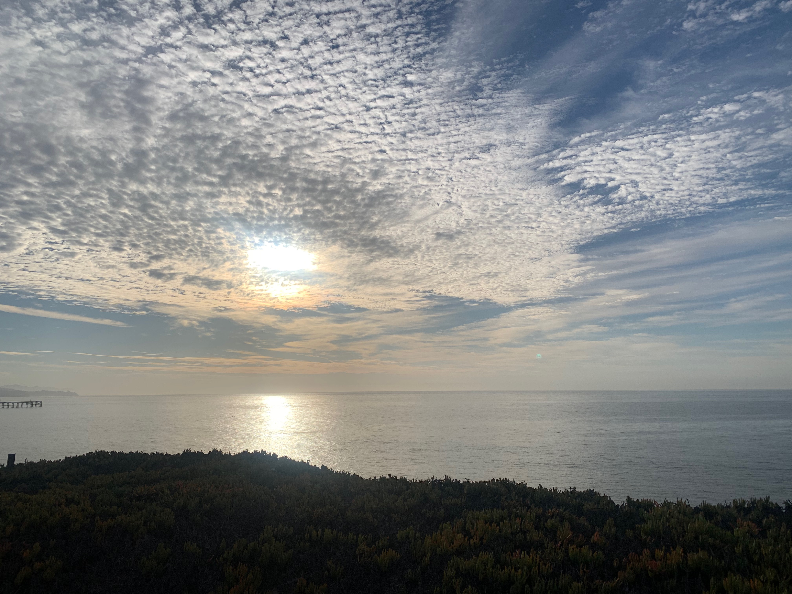

## Postdoctoral Research
I study cloud microphysics -- the microscopic particles like aerosols and droplets that make up clouds -- from the perspective of modeling, understanding, and predicting future climate. As a Lawrence Fellow at Lawrence Livermore National Lab, I am applying machine learning to solve challenges in parameterizing cloud microphysics and to bridge gaps between models and observations.

## PhD Research
My PhD research at Caltech centered on the question of how we can improve the mathematical representation of cloud droplets and hydrometeors in climate models. With better models, we can reduce uncertainty about climate projections related to clouds and aerosol-cloud interactions. Most of my work involved creating and testing modeling frameworks in idealized settings, but I also applied remote sensing data to better understand aerosol-cloud interaction from the top-down.

As a Dept. of Energy Computational Science Graduate Fellow, I have also had the opportunity to research at the National Renewable Energy Lab in Golden, CO. My work at NREL focuses on understanding the atmospheric dynamics and mechanisms of low-level jets that form off the coast of the US Mid-Atlantic, as well as the potential impact of these winds on future offshore wind energy.

## Mountains of Adventure
When I'm not in front of the computer, you are likely to find me enjoying the great outdoors, particularly the mountains of Calfornia and Colorado. Bicycling, climbing, running, and mountaineering are a few of my favorite ways to spend time. And as long as there are clouds in the sky, it's all part of my "observational field work"!
