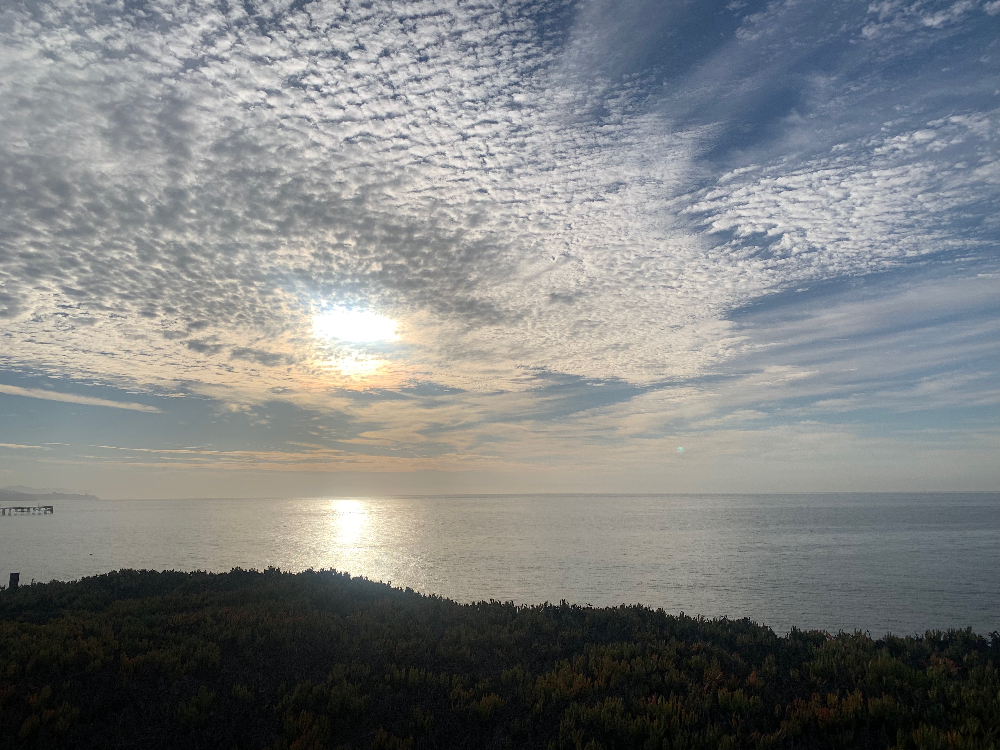

📍 **Starting Fall 2027:** Assistant Professor, Dept. of Atmospheric & Oceanic Sciences, University of Colorado Boulder
*(Currently: Lawrence Postdoctoral Fellow, Lawrence Livermore National Laboratory)*

## Join my group

I'll be building a research group at [CU Boulder's ATOC department](https://www.colorado.edu/academics/grad-atmospheric-oceanic-sciences) starting Fall 2027, working on machine learning for cloud microphysics, climate model parameterization, and AI-based weather and climate emulation. If you're a prospective PhD student interested in any of this, I'd love to hear from you -- feel free to reach out, and see the ATOC program page above for admissions details and deadlines.

## Research

I study cloud microphysics -- the aerosols and droplets that make up clouds -- and how we represent them in climate models, working at the intersection of machine learning, high-fidelity simulation, and observational inference. My work includes:

- ML emulators and reduced-order models for how particle size distributions evolve
- Probabilistic inference of 3D cloud properties from satellite observations
- High-fidelity simulation using the Superdroplet Method and E3SM/EAMxx
- Seasonal predictability of coupled AI weather/climate emulators

The throughline connects micron-scale cloud physics to global climate predictions, especially around aerosol-cloud interactions -- one of the largest remaining sources of uncertainty in climate projections.

## Education & Appointments

- B.S., Chemical Engineering
- Ph.D., Mechanical Engineering, California Institute of Technology -- improving how climate models mathematically represent cloud droplets and hydrometeors, plus top-down analysis of aerosol-cloud interaction from remote sensing ([thesis](https://doi.org/10.7907/yv2y-kg55))
- DOE Computational Science Graduate Fellow, National Renewable Energy Laboratory -- researched low-level jets and offshore wind potential off the US Mid-Atlantic coast
- Lawrence Postdoctoral Fellow, Lawrence Livermore National Laboratory -- applying machine learning to cloud microphysics parameterization and bridging models with observations
- Assistant Professor, Dept. of Atmospheric & Oceanic Sciences, University of Colorado Boulder *(beginning Fall 2027)*

## Mountains of Adventure

When I'm not in front of the computer, you're likely to find me enjoying the great outdoors, particularly the mountains of California and Colorado. Bicycling, climbing, running, and mountaineering are a few of my favorite ways to spend time. And as long as there are clouds in the sky, it's all part of my "observational field work"!
